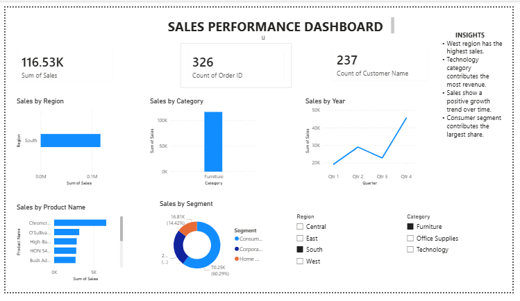

# Task 2 - Data Visualization and Storytelling

## Objective

Create meaningful visualizations and derive business insights using a sales dataset.

## Tools Used

* Power BI Desktop
* Microsoft Excel

## Dataset

Superstore Sales Dataset

## Visualizations Created

1. Sales by Region
2. Sales by Category
3. Sales Trend Over Time
4. Top 10 Products by Sales
5. Sales by Customer Segment

## Key Insights

* West region generated the highest sales.
* Technology and Office Supplies are major contributors to revenue.
* Consumer segment contributes the highest sales share.
* Sales have shown growth over time.
* Top products account for a significant portion of total revenue.

## Files Included

* Power BI Dashboard (.pbix)
* Dataset (.csv)
* Dashboard Screenshot (.png)

## Outcome

Created an interactive dashboard that helps analyze sales performance and supports data-driven decision making.
## Dashboard Preview

